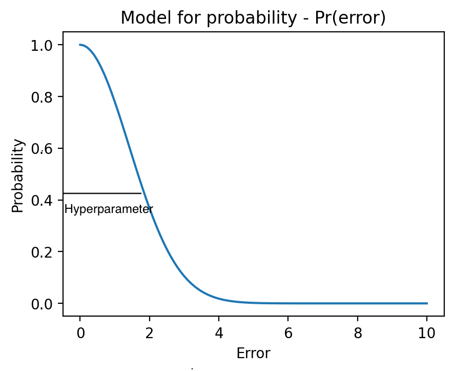
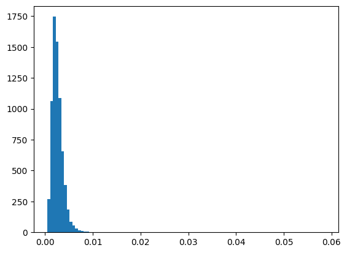
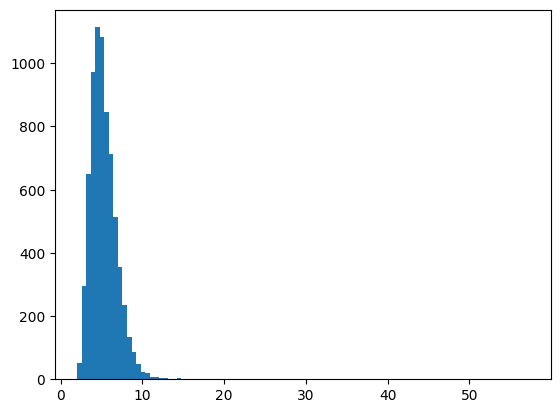
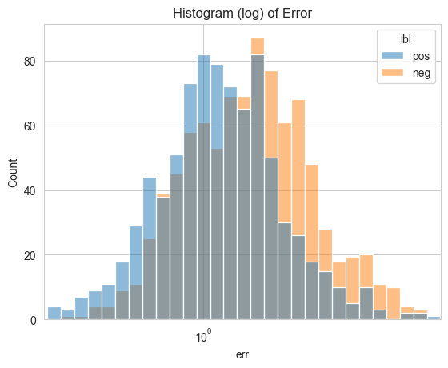
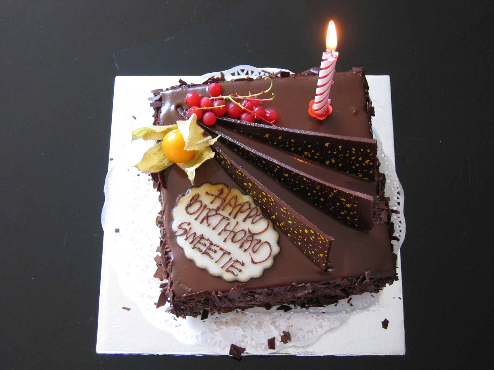
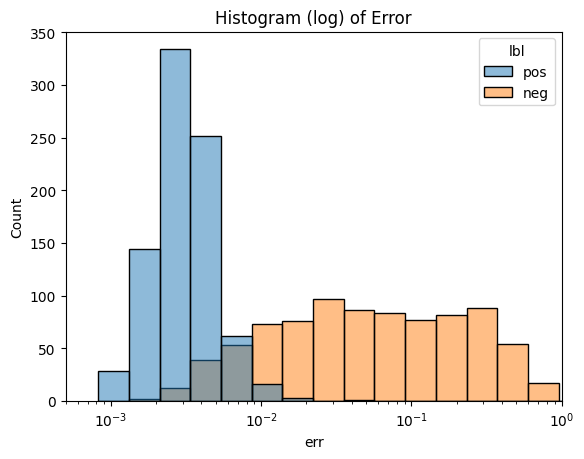

# The problem statement:
teach an ML model to say ‘I don’t know’

# Math formulation:
identify significant differences between training data and data in production. In that case, the task can be classified as an anomaly detection problem.

# Toy example:
weed classification with CNN.

# Architecture:

## Data:
### 8 classes + negative
Example 'in-class'.

Example 'non-class'.

## Model 1:
ResNet34 (CNN) with replaced FC layer and parallel feature output (512d).

## Model 2:
### 1) Autoencoder.
### 2) Variational autoencoder.

## Decision rules:
### Naive.
If all indexes have probability less than 0.5, classify as anomaly
### Separate.
if reconstruction error is higher than some threshold (hyperparameter), classify as anomaly
### Multiplication.
Probability from classification head is multiplied by probability function output of Model 2. If all indexes have probability less than 0.5, classify as anomaly.

## Training:
Only on the data with 'in-class' (6'831 images - 8 classes).
### Model 1 + Classification head.
- ResNet34 (pre-trained),
- FC overwritten,
- full scale fine-tuning.
#### Final accuracy on validation sample (849 images - 8 classes):

93.928%
#### Remarks: simple augmentation (rotation) increased training error but significantly (10%) decreased validation error

### Model 2:
#### Autoencoder.
Model: 512, 256, 128, [bottleneck_dim: 16, 32, 64],128, 256, 512. Activation: ReLu.

Autoencoder error:

#### VAE
Model: 512, 256, [latent_dim: 16, 32, 64], 256, 512.. Activation: LeakyReLu.

## Test 1. Binary (+ identification of hyperparameters).
### Data:
binary, 50/50 split (anomalies of the same ‘nature’)

### Naive approach.
Test accuracy: 53.85%

Non-anomalies to total: 48.03%
### Separate approach.
#### Autoencoder:
| dim  | acc   | param |
|------|-------|-------|
| 16   | 57.74 | 1.3   |
| 32   | 60.14 | 1.3   |
| 64   | 59.74 | 1.2   |

#### VAEs:
| dim | acc   | param |
|-----|-------|-------|
| 16  | 67.73 | 0.98  |
| 32  | 67.90 | 0.84  |
| 64  | 67.68 | 1.00  |

### Multiplication approach.
#### Autoencoder:
| dim | acc   | param |
|-----|-------|-------|
| 16  | 63.51 | 1.1   |
| 32  | 65.28 | 1.3   |
| 64  | 64.48 | 1.2   |

#### VAEs:
| dim | acc   | param |
|-----|-------|-------|
| 16  | 68.42 | 0.72  |
| 32  | 68.65 | 0.70  |
| 64  | 68.30 | 0.70  |

## Test 2. Binary
### Data:
binary, 50/50 split (anomalies of the different ‘nature’)
##### Examples:

### Naive approach.
Test accuracy: 50.74%

Non-anomalies to total: 49.97%

### Multiplication approach.
#### Autoencoder
Test accuracy: 85.86%
#### VAE
Test accuracy: 43.37%
### Separate approach.
#### Autoencoder
Test accuracy: 80.39%

## Test 3. Classification
### Data:
8 classes + class 'unknown', equal split
### Naive approach.
Test accuracy: 81.97%
### Multiplication approach.
#### Autoencoder
Test accuracy: 82.48%
### Separate approach.
#### Autoencoder
Test accuracy: 73.93%

## Why decrease?
Only 73.4% of pictures with known label are identified as 'in-class' (97.92% recall for 'non-class')

### Our utility function was based on:
- maximization of accuracy of 'non-class' detection 
- 'non-class' pictures are close to 'in-class'
#### => choice of hyperparameters.

### New assumptions:
#### - pictures of different nature represent expected anomalies
#### - cost of misclassification for every class is the same (including 'non-class') = max(accuracy)
Best classification accuracy: 90.93%

#### Related:
- Binary total accuracy: 91.8%
- Binary 'non-class' recall: 95.54%
- Binary 'in-class' recall: 88.06%