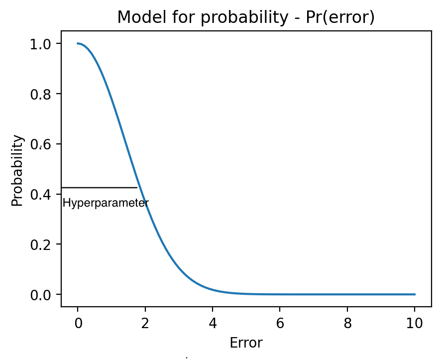

# Final project

## Classification

The problem statement: teach a ML model to say ‘I don’t know’
Math formulation: identify significant differences between training data and data in production. In that case, the task can be classified as an anomaly detection problem.

Toy example: weed classification with CNN.

Architecture: 

Data: 8 classes + negative

Model 1: ResNet34 (CNN) with replaced FC layer and parallel feature output (512d).

Model 2:
Autoencoder.
Variational autoencoder.

Decision rules:
Naive.
If all indexes have probability less than 0.5, classify as anomaly
Separate.
if reconstruction error is higher then some threshold (hyper-parameter), classify as anomaly
Multiplication.
Probability from classification head is multiplied by probability function output of Model 2. If all indexes have probability less than 0.5, classify as anomaly.
Training: Only on the data with known classes.

Model 1 + Classification head.
ResNet34 (pre-trained), FC overwritten, full scale fine-tuning.
Final accuracy on validation sample: 
Remarks: simple augmentation increased training error but significantly (10%) decreased validation error

Model 2:
Autoencoder.
Model:
VAE
Model:

Test 1 (+ identification of hyper-parameters).
Data: binary, 50/50 split (anomalies of the same ‘nature’)

Naive approach.

Separate approach.
Autoencoder:

VAEs:

Multiplication approach.

Test 2.
Data: binary, 50/50 split (anomalies of the different ‘nature’)

Naive approach.

Multiplication approach.
Autoencoder

VAE

Separate approach.
Autoencoder

Test 3. Classification

